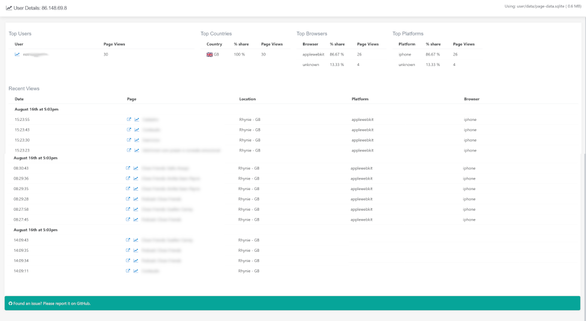

# Page Stats Plugin





The **Page Stats** Plugin is an extension for [Grav CMS](http://github.com/getgrav/grav).

Enhaced statistics for grav

This plugin will create a new entry in the admin plugin sidebar to display enhaced page stats about your site!


Stats Available:
* Page Views
* Unique IP's
* Unique Users
* Top users (by page views)
* Latest viewed pages
* Top Pages (by page views)
* Top country (by page views)
* Top browser (by page views)
* Top platform / device (by page views)
* Detailed Page Statistics

## First Run
When you first run this plugin it will create a new sqlite database to store the data, it's location can be defined in the plugin config, defaults to ```user/data/page-data.sqlite```

>

## Configuration

Before configuring this plugin, you should copy the `user/plugins/page-stats/page-stats.yaml` to `user/config/plugins/page-stats.yaml` and only edit that copy.

> Note:
> If DB file does not exists it will be created on first run
>
> Bot detection is based on user agent, it is not perfect, but it does work well


Note that if you use the Admin Plugin, a file with your configuration named page-stats.yaml will be saved in the `user/config/plugins/` folder once the configuration is saved in the Admin.

### Front Matter
You can exclude pages from analytics by disabling the plugin in the page front matter as follows:
```
---
page-stats:
    process: false
---
```


## Installation

Installing the Page Stats plugin can be done in one of three ways: The GPM (Grav Package Manager) installation method lets you quickly install the plugin with a simple terminal command, the manual method lets you do so via a zip file, and the admin method lets you do so via the Admin Plugin.


### GPM Installation (Preferred)

To install the plugin via the [GPM](http://learn.getgrav.org/advanced/grav-gpm), through your system's terminal (also called the command line), navigate to the root of your Grav-installation, and enter:

    bin/gpm install page-stats

This will install the Page Stats plugin into your `/user/plugins`-directory within Grav. Its files can be found under `/your/site/grav/user/plugins/page-stats`.

### Manual Installation

1. Download the zip-version of this repository and unzip it under `/your/site/grav/user/plugins`. You can find these files on [GitHub](https://github.com//grav-plugin-page-stats)
2. Then rename the folder to `page-stats`
2. Copy the `user/plugins/page-stats/page-stats.yaml` to `user/config/plugins/page-stats.yaml` and only edit that copy.

### Admin Plugin

If you use the Admin Plugin, you can install the plugin directly by browsing the `Plugins`-menu and clicking on the `Add` button.


## Usage

Just install and have fun!
There is notnhing you need to do, plugin will work out of the box

Have a look at the Grav Error log to ensure plugin is working fine

## Credits

This plugin includes IP2Location LITE data available from <a href="https://lite.ip2location.com">https://lite.ip2location.com</a>.

Flags from https://flagpedia.net

## To Do


- [X] Browser / device stats (based on user agent)
- [X] User behaviour (select user and see the session history and page flows)
- [X] Top country stats
- [X] Page details (select page and seee detailed stats about that page)
- [X] Referer logging
- [ ] World map view
- [ ] Referer analysis, to better understand where users are comming from
- [ ] Time on page
- [ ] custom events triggered by javascript


